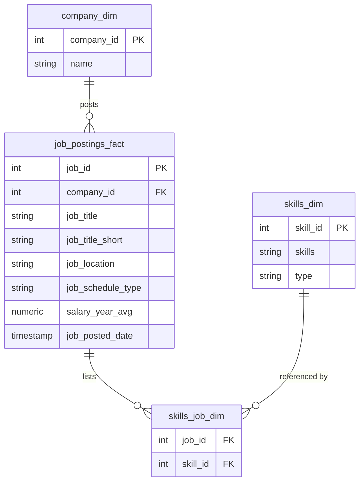

# Data Job Market Analysis with SQL

An exploratory SQL analysis of **2023 job postings** for data roles — Data Analyst, Data Scientist, Data Engineer and related titles — built to answer one practical question:

> If you want to work in data, which skills are actually worth learning first?

"Worth learning" can mean two different things: the skills that appear in the *most* job postings, and the skills that appear in the *highest-paying* ones. These two lists are not the same, and the point of this project is to find where they overlap.

---

## Table of Contents

- [Dataset and Schema](#dataset-and-schema)
- [Tools Used](#tools-used)
- [Repository Structure](#repository-structure)
- [The Analysis](#the-analysis)
  - [1. Highest-paying remote data jobs](#1-highest-paying-remote-data-jobs)
  - [2. Which skills those top-paying jobs require](#2-which-skills-those-top-paying-jobs-require)
  - [3. The most in-demand skills overall](#3-the-most-in-demand-skills-overall)
  - [4. The skills associated with the highest salaries](#4-the-skills-associated-with-the-highest-salaries)
  - [5. The most optimal skills: demand meets salary](#5-the-most-optimal-skills-demand-meets-salary)
- [Key Insights](#key-insights)
- [What I Learned](#what-i-learned)
- [Limitations and Future Work](#limitations-and-future-work)
- [Conclusion](#conclusion)

---

## Dataset and Schema

The data covers real job postings collected during **2023**, with title, location, schedule type, posting date, average yearly salary, employer, and the set of skills mentioned in each posting.

It is modeled as a **star schema**: one fact table of postings, surrounded by dimension tables, with a bridge table resolving the many-to-many relationship between postings and skills.



Two conventions in the data matter for reading the queries below:

- `job_location = 'Anywhere'` is how the dataset marks a **fully remote** role.
- `salary_year_avg` is **frequently NULL** — most postings never publish a salary. Every salary query filters these rows out, which means all salary figures here describe the *subset of postings that disclosed pay*, not the market as a whole.

---

## Tools Used

| Tool | Role in the project |
|---|---|
| **PostgreSQL** | The database engine. Chosen for its support of CTEs, window-friendly aggregation and clean `ROUND`/`AVG` behaviour. |
| **SQL** | The entire analysis: joins, filtering, aggregation, grouping and common table expressions. |
| **Visual Studio Code** | Editor for writing and running the queries, with results exported as JSON and embedded alongside each query as documentation. |
| **Git & GitHub** | Version control and publishing, so each query and its result set live together in one reviewable history. |

---

## Repository Structure

```
Project_SQlL/
└── SQL_files/
    ├── highest_paying_jobs.sql      # Q1 — top 10 paying remote data jobs
    ├── In_demand_skills.sql         # Q2 — skills required by the top-paying jobs
    ├── jobs_for_top_skills.sql      # Q3 — most in-demand skills by posting count
    ├── highest_paying_skills.sql    # Q4 — skills ranked by average salary
    └── most_optimal_skills.sql      # Q5 — demand and salary combined
```

Each `.sql` file ends with a block comment containing the reasoning behind the query and, where relevant, the raw JSON result set — so the file is self-contained and reproducible without access to the database.

---

## The Analysis

The five queries are deliberately sequential: each one answers a question raised by the one before it.

### 1. Highest-paying remote data jobs

**Question:** what does the ceiling of this market look like?

The query pulls the ten best-paid remote postings titled Data Analyst or Data Scientist, discarding rows with no salary, and joins `company_dim` to recover employer names. A **LEFT JOIN** is used here on purpose: a posting with a missing or unmatched company should still appear in the ranking rather than silently disappear.

```sql
SELECT
    job_id, job_location, job_title, job_title_short,
    job_schedule_type, salary_year_avg, job_posted_date,
    name AS company_name
FROM job_postings_fact
LEFT JOIN company_dim ON company_dim.company_id = job_postings_fact.company_id
WHERE job_location = 'Anywhere'
  AND (job_title_short = 'Data Analyst' OR job_title_short = 'Data Scientist')
  AND salary_year_avg IS NOT NULL
ORDER BY salary_year_avg DESC
LIMIT 10;
```

**Results:**

| Job title | Company | Avg. yearly salary |
|---|---|---|
| Data Analyst | Mantys | $650,000 |
| Staff Data Scientist / Quant Researcher | Selby Jennings | $550,000 |
| Staff Data Scientist – Business Analytics | Selby Jennings | $525,000 |
| Data Scientist | Algo Capital Group | $375,000 |
| Head of Data Science | Demandbase | $351,500 |
| Director of Analytics | Meta | $336,500 |
| Head of Data Science | Demandbase | $324,000 |
| Director Level – Product Management, Data Science | Teramind | $320,000 |
| Director of Data Science & Analytics | Reddit | $313,000 |
| Distinguished Data Scientist | Walmart | $300,000 |

**What this shows:** the top of the market is not really a *data analyst* market at all. Eight of the ten roles are either Data Scientist titles or leadership positions — Head, Director, Principal, Distinguished. Pay at this level tracks seniority and scope far more than it tracks any individual tool. The dataset also contains at least one clear anomaly: a plain "Data Analyst" role at $650,000 with no skills attached and no supporting detail, almost certainly a data-quality artifact rather than a real offer.

### 2. Which skills those top-paying jobs require

**Question:** the previous query told us *who* pays the most — what do they ask for?

This one narrows to Data Analyst roles only, wraps the top-ten ranking in a **CTE**, and then joins through the bridge table to attach every skill listed on those postings. Two **INNER JOINs** are used deliberately this time: a posting with no skills attached has nothing to contribute to a question about skills, so dropping it is correct behaviour rather than data loss.

```sql
WITH top_paying_jobs AS (
    SELECT job_id, job_title, job_title_short, salary_year_avg,
           name AS company_name
    FROM job_postings_fact
    LEFT JOIN company_dim ON company_dim.company_id = job_postings_fact.company_id
    WHERE job_location = 'Anywhere'
      AND job_title_short = 'Data Analyst'
      AND salary_year_avg IS NOT NULL
    ORDER BY salary_year_avg DESC
    LIMIT 10
)
SELECT top_paying_jobs.*, skills
FROM top_paying_jobs
INNER JOIN skills_job_dim ON top_paying_jobs.job_id = skills_job_dim.job_id
INNER JOIN skills_dim     ON skills_job_dim.skill_id = skills_dim.skill_id
ORDER BY salary_year_avg DESC;
```

**Results:** of the ten highest-paying remote Data Analyst postings, eight had skills recorded. Across those eight:

| Skill | Postings (out of 8) |
|---|---|
| SQL | 8 |
| Python | 7 |
| Tableau | 6 |
| R | 4 |
| Excel | 3 |
| Snowflake / Oracle / Azure / AWS | 2 each |

**What this shows:** SQL is not one option among many at the top of the market — it is universal, appearing in every single posting that listed any skills at all. Python follows immediately behind. Beyond that core pair, the requirement lists fragment quickly into company-specific stacks: cloud platforms, warehouses, and even collaboration tooling like Jira, Confluence and Bitbucket. The highest-paying job in the set (AT&T's Associate Director of Data Insights) listed thirteen distinct skills spanning analysis, cloud and presentation, which says a lot about what "senior" means in this field: breadth across the whole pipeline rather than depth in one tool.

### 3. The most in-demand skills overall

**Question:** the top ten postings are a tiny sample. Does the same pattern hold across the entire market?

This query drops the salary filter entirely — deliberately, because demand should be measured across *all* postings, not just the minority that disclose pay — and counts how many Data Analyst postings mention each skill.

```sql
SELECT
    skills,
    COUNT(job_postings_fact.job_id) AS num_of_jobs
FROM job_postings_fact
INNER JOIN skills_job_dim ON job_postings_fact.job_id = skills_job_dim.job_id
INNER JOIN skills_dim     ON skills_job_dim.skill_id = skills_dim.skill_id
WHERE job_title_short = 'Data Analyst'
GROUP BY skills
ORDER BY num_of_jobs DESC
LIMIT 5;
```

**Results:**

| Skill | Number of postings |
|---|---|
| SQL | 92,628 |
| Excel | 67,031 |
| Python | 57,326 |
| Tableau | 46,554 |
| Power BI | 39,468 |

**What this shows:** the top-ten finding scales. SQL leads by a wide margin at scale as well — roughly 38% ahead of Excel and 62% ahead of Python. The composition of the list is also revealing: two query/programming languages, one spreadsheet tool, and two BI platforms. The everyday Data Analyst job is defined by *extracting* data, *manipulating* it, and *communicating* it, and the market expects competence in all three.

Excel's second place deserves emphasis, since it is the skill most often dismissed as outdated. It is not — it simply lives in a different part of the market than the premium-salary roles do.

### 4. The skills associated with the highest salaries

**Question:** demand is one axis. What does the *pay* axis look like?

Here the ranking flips: instead of counting postings, the query averages salary per skill and takes the top 25.

```sql
SELECT
    skills,
    COUNT(job_postings_fact.job_id) AS num_of_jobs,
    ROUND(AVG(salary_year_avg), 0) AS salary_avg
FROM job_postings_fact
INNER JOIN skills_job_dim ON job_postings_fact.job_id = skills_job_dim.job_id
INNER JOIN skills_dim     ON skills_job_dim.skill_id = skills_dim.skill_id
WHERE job_title_short = 'Data Analyst'
  AND salary_year_avg IS NOT NULL
GROUP BY skills
ORDER BY salary_avg DESC
LIMIT 25;
```

**What this shows:** the list that comes back has almost no overlap with the demand list. It is dominated by specialised engineering, machine-learning and big-data tooling rather than the core analyst toolkit. The `num_of_jobs` column, which was included specifically to keep the salary figures honest, explains why: these premium skills appear in a *very* small number of postings each, so their averages rest on thin samples and are easily pulled upward by a handful of senior or niche roles.

The real signal is directional rather than numerical. Rare, infrastructure-adjacent skills carry a salary premium; ubiquitous ones do not — not because they are less valuable, but because value that everyone already has cannot be a differentiator.

This is exactly why the fifth query exists: ranking by salary alone rewards obscurity, which is terrible career advice on its own.

### 5. The most optimal skills: demand meets salary

**Question:** which skills score well on *both* axes at once?

The final query builds two CTEs — one measuring demand, one measuring average salary — and joins them on `skill_id`, then sorts by demand first and salary second. Both sides are restricted to remote postings with disclosed salaries so the two measures describe the same population of jobs.

```sql
WITH demand_for_skill AS (
    SELECT skills_job_dim.skill_id, skills_dim.skills,
           COUNT(job_postings_fact.job_id) AS num_of_jobs
    FROM job_postings_fact
    INNER JOIN skills_job_dim ON job_postings_fact.job_id = skills_job_dim.job_id
    INNER JOIN skills_dim     ON skills_job_dim.skill_id = skills_dim.skill_id
    WHERE job_title_short = 'Data Analyst'
      AND job_location = 'Anywhere'
      AND salary_year_avg IS NOT NULL
    GROUP BY skills_job_dim.skill_id, skills_dim.skills
),
salary_for_skills AS (
    SELECT skills_job_dim.skill_id, skills_dim.skills,
           COUNT(job_postings_fact.job_id) AS num_of_jobs,
           ROUND(AVG(salary_year_avg), 0) AS salary_avg
    FROM job_postings_fact
    INNER JOIN skills_job_dim ON job_postings_fact.job_id = skills_job_dim.job_id
    INNER JOIN skills_dim     ON skills_job_dim.skill_id = skills_dim.skill_id
    WHERE job_title_short = 'Data Analyst'
      AND salary_year_avg IS NOT NULL
      AND job_location = 'Anywhere'
    GROUP BY skills_job_dim.skill_id, skills_dim.skills
)
SELECT
    demand_for_skill.skill_id,
    demand_for_skill.skills,
    demand_for_skill.num_of_jobs,
    salary_for_skills.salary_avg
FROM demand_for_skill
INNER JOIN salary_for_skills ON demand_for_skill.skill_id = salary_for_skills.skill_id
ORDER BY num_of_jobs DESC, salary_avg DESC;
```

**What this shows:** SQL, Python and Excel sit at the top of the combined ranking. They do not win on salary alone — nothing ubiquitous ever will — but they are the only skills that appear in enough well-paid remote postings to be a reliable investment. The premium tools from Query 4 may pay more per posting, but each one opens a door that is only occasionally unlocked.

---

## Key Insights

1. **SQL is the non-negotiable skill.** It leads on raw demand (92,628 postings) and it appeared in *every* top-paying remote Data Analyst posting that listed skills. No other skill is both that common and that consistently present at the top.
2. **Demand and salary are close to orthogonal.** The five most-demanded skills and the twenty-five best-paid skills barely intersect. Optimising for either alone gives bad advice: chase demand only and you cap your ceiling; chase salary only and you specialise into a market of a few dozen openings.
3. **High pay tracks seniority, not tooling.** The best-paid postings are Director, Head, Principal and Staff roles. The tools are table stakes; the title is what moves the number.
4. **Breadth wins at the top.** The single highest-paying analyst role listed thirteen skills spanning querying, cloud infrastructure, ML libraries and presentation software — evidence that senior analysts are expected to own the whole pipeline from warehouse to stakeholder.
5. **Excel has not been replaced.** Second in demand across the entire market, ahead of Python. It is simply concentrated in a different salary band than the headline roles.
6. **Rarity, not difficulty, drives the salary premium.** Niche big-data and ML tooling commands higher averages largely because scarce supply meets specialised demand — and because those averages are computed over very few postings.

---

## What I Learned

**Choosing a join is an analytical decision, not a syntactic one.** The single sharpest lesson of this project. In Query 1 a LEFT JOIN is correct because a posting with an unmatched company is still a valid data point in a salary ranking. In Query 2 an INNER JOIN is correct because a posting with no skills contributes nothing to a question about skills. Swapping them silently changes what the result actually means, and the query still runs either way.

**CTEs turn a hard query into a readable one.** Query 2 needed a filtered top-ten list *before* skills could be attached to it, and Query 5 needed two independent aggregations compared side by side. Both would be unreadable as nested subqueries. Writing them as named CTEs made each step testable in isolation, which is how I debugged them.

**Filters define the population you're describing.** Because `salary_year_avg` is NULL for most postings, `WHERE salary_year_avg IS NOT NULL` does not merely clean the data — it silently redefines the question from "the data job market" to "the disclosed-salary data job market". Recognising when to apply that filter (all salary queries) and when to leave it off (Query 3, measuring raw demand) shaped every conclusion here.

**An average without a count is a number you cannot trust.** Adding `COUNT(...)` beside `AVG(salary_year_avg)` in Query 4 was the change that made the results interpretable. It revealed that the top-paid skills sat on samples of a handful of postings each, and it is the reason Query 5 exists at all.

**Outliers should be investigated, not deleted.** The $650,000 Data Analyst posting is almost certainly bad data, but tracing *why* — no skills attached, no corroborating detail, wildly out of line with the next entry — taught me more about the dataset's collection method than any clean row did.

**Documenting a query while writing it is worth the time.** Keeping the reasoning and JSON output in a block comment inside each `.sql` file meant that returning to a query days later cost no re-derivation at all, and it makes the repository reviewable without database access.

---

## Limitations and Future Work

Being explicit about what this analysis *cannot* say:

- **Skill co-occurrence is not modelled.** Every query treats skills independently, but the interesting question is combinatorial: does *SQL + Python + a cloud platform* pay more than the sum of its parts? A self-join on `skills_job_dim` would answer this.
- **Salary coverage is partial and non-random.** Postings that disclose pay likely differ systematically from those that do not — larger employers, certain jurisdictions with pay-transparency laws — so every salary figure carries an unmeasured selection bias.
- **Means are fragile; medians are not.** Switching `AVG` to `PERCENTILE_CONT(0.5)` would stop single outliers like the $650,000 posting from distorting per-skill figures.
- **No minimum-sample threshold.** Query 4 would be considerably more honest with a `HAVING COUNT(job_id) >= 10` clause to suppress skills backed by one or two postings.
- **Title normalisation is coarse.** `job_title_short` flattens Junior, Senior and Director into a single bucket, which mixes experience levels that should be separated. Splitting by seniority would sharpen every result here.
- **The two CTEs in Query 5 currently share identical filters**, so they aggregate over the same row set. Relaxing the demand CTE to include postings without disclosed salaries would make the demand-versus-pay comparison genuinely two-sided.
- **Static snapshot.** 2023 only, so nothing here captures trend — whether a skill is rising or being displaced.

---

## Conclusion

Starting from the ceiling of the market and working down to the floor, the picture that emerges is consistent: **SQL and Python form the foundation, visualisation tools make that work legible to other people, and seniority is what actually moves compensation.**

The more durable lesson was methodological. Every substantive finding in this project came from a decision made *before* the aggregation ran — which join preserves the rows that matter, which filter defines the right population, which count keeps an average honest. The SQL itself is not complicated. Knowing what question each clause is really answering is the part that took the work.

For anyone entering the field, the practical takeaway is to build the common foundation first and treat the premium, niche tooling as a later specialisation rather than a shortcut. The data is quite clear that scarcity pays well but opens few doors, while ubiquity opens nearly all of them.
